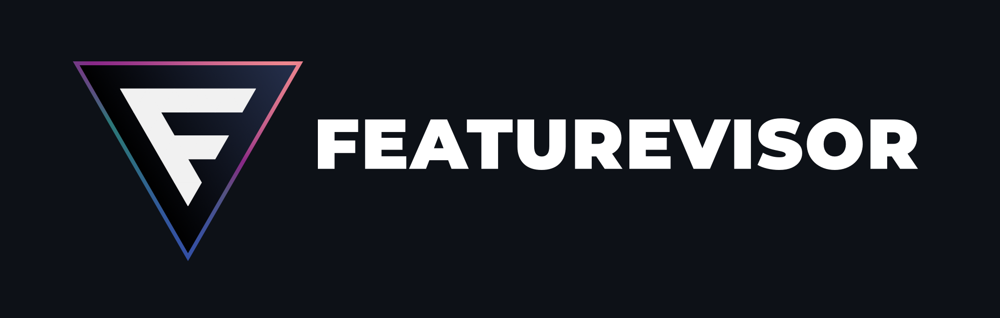

[](https://featurevisor.com)

<div align="center">
  <h3><strong>Feature management for developers</strong></h3>
</div>

<div align="center">
  <small>Manage your feature flags and experiments declaratively from the comfort of your Git workflow.</small>
</div>

<br />

<div align="center">
  <!-- NPM version -->
  <a href="https://npmjs.org/package/@featurevisor/sdk">
    
  </a>
  <!-- Discord -->
  <a href="https://discord.gg/8mkW89JB">
    
  </a>
  <!-- License -->
  <a href="./LICENSE">
    
  </a>
</div>

<div align="center">
  <h3>
    <a href="https://featurevisor.com">
      Website
    </a>
    <span> | </span>
    <a href="https://featurevisor.com/docs">
      Documentation
    </a>
    <span> | </span>
    <a href="https://github.com/fahad19/featurevisor/issues">
      Issues
    </a>
    <span> | </span>
    <a href="https://featurevisor.com/docs/contributing">
      Contributing
    </a>
    <span> | </span>
    <a href="https://github.com/fahad19/featurevisor/blob/main/CHANGELOG.md">
      Changelog
    </a>
  </h3>
</div>

<div align="center">
  <sub>Built by
  <a href="https://twitter.com/fahad19">@fahad19</a> and
  <a href="https://github.com/fahad19/featurevisor/graphs/contributors">
    contributors
  </a>
</div>

---

# What is Featurevisor?

Featurevisor is a solution for managing your feature flags, experiments, and remote config. It's built for developers, by developers.

Workflow can be broken down into 3 steps:

- 1️⃣ Manage feature flags, experiments, and remote config in your Git repository
- 2️⃣ Trigger CI/CD pipeline to generate and upload datafiles (static JSON files) to your CDN
- 3️⃣ Fetch and evaluate datafiles in your applications using Featurevisor SDKs

More documentation available at [https://featurevisor.com](https://featurevisor.com).

Supported features:

- 🚩 **Feature flags**: classic on/off switches
- 🆎 **Experimentation**: a/b and multivariate tests
- 👥 **Segmentation**: reusable conditions for targeting groups of users
- ↗️ **Gradual rollouts**: avoid big bang releases, and go from 0% to 100% rollout gradually
- 🔧 **Variables**: store key/value pairs for remote config namespaced under each feature
- 🎯 **Consistent bucketing**: makes sure same user gets same variation across devices/sessions
- 🌏 **Multiple environments**: Go beyond just staging and production to fit your needs
- 🏷️ **Tagging**: Load only features relevant to your application, avoiding bloat
- 👁️ **Tracking**: Track experiment activations with your favourite analytics tool

SDK support:

- [JavaScript](https://featurevisor.com/docs/sdks/) (both Node.js and browser environments)
- [React](https://featurevisor.com/docs/react/)
- [Vue.js](https://featurevisor.com/docs/vue/)

Swift and Kotlin SDKs are coming soon for native apps.

# Quick start

You are recommended to see a more detailed quick start guide here: [https://featurevisor.com/docs/quick-start/](https://featurevisor.com/docs/quick-start/).

The whole process can be broken down into 3 steps:

## Step 1: Create a Featurevisor project

Install Featurevisor CLI globally (or use `npx @featurevisor/cli`):

```
$ npm install -g @featurevisor/cli
```

Initialize a new Featurevisor project:

```
$ mkdir my-featurevisor-project && cd my-featurevisor-project
$ featurevisor init
```

You can now create and manage your feature flags, experiments, and remote config in this directory expressed as YAMLs.

See the building block guides here:

- [Attributes](https://featurevisor.com/docs/attributes/): building block for conditions
- [Segments](https://featurevisor.com/docs/segments/): conditions for targeting users
- [Features](https://featurevisor.com/docs/features/): feature flags and variables with rollout rules

## Step 2: Build and deploy datafiles

Once the project is ready, you can build your datafiles (JSON files containing configuration of your feature flags):

```
$ featurevisor build
```

You will find the output in `dist` directory, that you can upload to your CDN.

See further guides here:

- [Building datafiles](https://featurevisor.com/docs/building-datafiles/): how to build datafiles
- [Deploying datafiles](https://featurevisor.com/docs/deployment/): how to deploy datafiles to your CDN

A fully functioning example for deploying with Cloudflare and GitHub Actions (for free) is available [here](https://github.com/fahad19/featurevisor-example-cloudflare).

## Step 3: Consume datafiles with Featurevisor SDKs

You can now consume the datafiles from your CDN in your applications directly using Featurevisor SDKs.

For Node.js and browser environments, install the JavaScript SDK:

```
$ npm install --save @featurevisor/sdk
```

Now you can initialize the SDK with the URL of your datafile, and evaluate your feature flags:

```js
import { createInstance } from "@featurevisor/sdk";

// Initialize the SDK
const f = createInstance({
  datafileUrl: "https://cdn.yoursite.com/datafile.json",
  onReady: () => console.log("Datafile has been fetched and SDK is ready"),
});

// Evaluate a feature flag
const featureKey = "myFeature";
const context = {
  userId: "user-123",
  country: "nl",
};

const isEnabled = f.isEnabled(featureKey, context);
const variation = f.getVariation(featureKey, context);
const variable  = f.getVariable(featureKey, "someVariableKey", context);
```

Learn more about SDK usage here: [https://featurevisor.com/docs/sdks/](https://featurevisor.com/docs/sdks/).

# Packages

| Package                                 | Description                                |
|-----------------------------------------|--------------------------------------------|
| [@featurevisor/cli](./packages/cli)     | CLI package                                |
| [@featurevisor/core](./packages/core)   | Core package used by CLI                   |
| [@featurevisor/react](./packages/react) | React package                              |
| [@featurevisor/sdk](./packages/sdk)     | Universal SDK for both Node.js and browser |
| [@featurevisor/site](./packages/site)   | Static site generator for your project     |
| [@featurevisor/types](./packages/types) | Common typings                             |
| [@featurevisor/vue](./packages/vue)     | Vue.js package                             |

# License

MIT © [Fahad Heylaal](https://fahad19.com)
