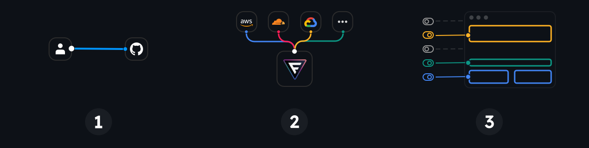

  <h3><strong>Feature management with version control</strong></h3>

  <small>Manage your feature flags, experiment variations, variables for remote configuration declaratively from the comfort of your Git workflow.</small>

  <h3>
    <a href="https://featurevisor.com">
      Website
    </a>
     | 
    <a href="https://featurevisor.com/docs/quick-start">
      Documentation
    </a>
     | 
    <a href="https://github.com/featurevisor/featurevisor/issues">
      Issues
    </a>
     | 
    <a href="https://featurevisor.com/docs/contributing">
      Contributing
    </a>
     | 
    <a href="https://github.com/featurevisor/featurevisor/blob/main/CHANGELOG.md">
      Changelog
    </a>
  </h3>

  Built by
  <a href="https://twitter.com/fahad19">@fahad19</a> and
  <a href="https://github.com/featurevisor/featurevisor/graphs/contributors">
    contributors
  </a>

---

## How does it work?

Three simple steps to visualize it:

1. Manage your Featurevisor [project](https://featurevisor.com/docs/project) in a Git repository
1. Build and upload [datafiles](https://featurevisor.com/docs/building-datafiles) (static JSON files) to your CDN or custom server
1. Fetch the datafile in your application, and evaluate features using [SDKs](https://featurevisor.com/docs/sdks)

## What do I need to use Featurevisor?

- A Git repository for managing your [project](https://featurevisor.com/docs/project) declaratively
- A CI/CD pipeline (like [GitHub Actions](https://featurevisor.com/docs/integrations/github-actions/)) for building and uploading the [datafiles](https://featurevisor.com/docs/building-datafiles)
- A CDN or custom server for serving the generated [datafiles](https://featurevisor.com/docs/building-datafiles)

Featurevisor [SDKs](https://featurevisor.com/docs/sdks/javascript) will take care of the rest for you.

## Supported SDKs

- [JavaScript](https://featurevisor.com/docs/sdks/javascript) (both Node.js and browser environments)
- [Go](https://featurevisor.com/docs/sdks/go/)
- [Python](https://featurevisor.com/docs/sdks/python/)
- [PHP](https://featurevisor.com/docs/sdks/php/)
- [Ruby](https://featurevisor.com/docs/sdks/ruby/)
- [Java](https://featurevisor.com/docs/sdks/java/)
- [Swift](https://featurevisor.com/docs/sdks/swift/)
- [React](https://featurevisor.com/docs/react/)
- [React Native](https://featurevisor.com/docs/react-native/)
- [Next.js](https://featurevisor.com/docs/frameworks/nextjs/)
- [Vue.js](https://featurevisor.com/docs/vue/)

## Why should I use Featurevisor?

Several use cases include:

- [Decoupling application deployments from feature releases](https://featurevisor.com/docs/use-cases/decouple-releases-from-deployments/)
- [Progressive delivery with gradual rollout of features](https://featurevisor.com/docs/use-cases/progressive-delivery/)
- [Testing in production](https://featurevisor.com/docs/use-cases/testing-in-production/)
- [Experiment with A/B and Multivariate tests](https://featurevisor.com/docs/use-cases/experiments/)
- [Role-based feature gating](https://featurevisor.com/docs/use-cases/entitlements/)
- [Remote configuration with advanced variables](https://featurevisor.com/docs/use-cases/remote-configuration/)
- [Establishing feature ownership and governance](https://featurevisor.com/docs/use-cases/establishing-ownership/)
- [Trunk based development](https://featurevisor.com/docs/use-cases/trunk-based-development/)
- [Aligning multiple teams in a microfrontends architecture](https://featurevisor.com/docs/use-cases/microfrontends/)
- [Feature depdendencies management](https://featurevisor.com/docs/use-cases/dependencies/)
- [Deprecating features safely](https://featurevisor.com/docs/use-cases/deprecation/)

# License

MIT © [Fahad Heylaal](https://fahad19.com)
